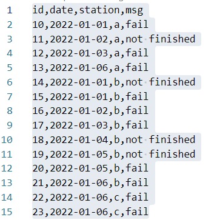
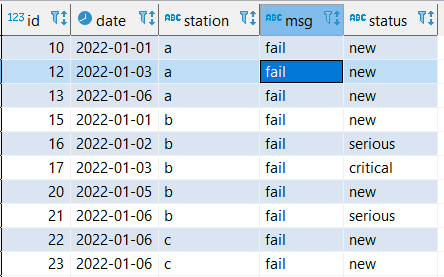

# tasks

### task 1

- navigate to task one folder
```sh
cd .\task_one\
```
- start airflow, postgre in docker
```sh
docker compose up
```
- restart scheduler if needed in the first run
- connect to locally running postgresql according to creds in **load_csv.sh** and run following script:
```sql
select * from public.events
```

### task 2
- **data_mart.sql** is responsible for creation the data mart and perform regular updates
    - it also contains join with *date_dimension* table
    - there is no need to use it in given scenario
        - but might be used in a real data warehouse built according to Kimball schema
- postgresql allows to use pg_cron extension in order to perform scheduled sql runs
    - unfortunately, official postgresql 13 image doesn't contain **pg_cron** 
    - but in case it will be on-prem postgresql or RDS postgre, it will be possible to use it
    - it will be also possible to create stored procedures with insert + update statements in order refresh the data mart
    - also there is a way to setup a trigger which will update the data mart table in case a row was inserted into *withdrawals* or *deposits* tables
- in case of usage external tools:
    - airflow (+dbt) or any orchestrator other orchestrator can be used

### task 3
- navigate to task three folder
```sh
cd .\task_three\
```
- start airflow, postgre in docker
```sh
docker compose up
```
- restart scheduler if needed in the first run
- input **diagnostics.csv** file:

- output station_errors table:
